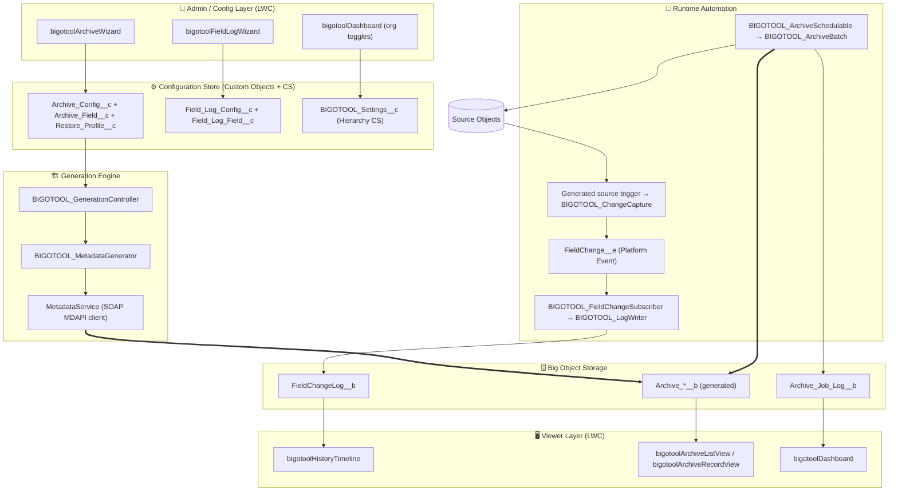
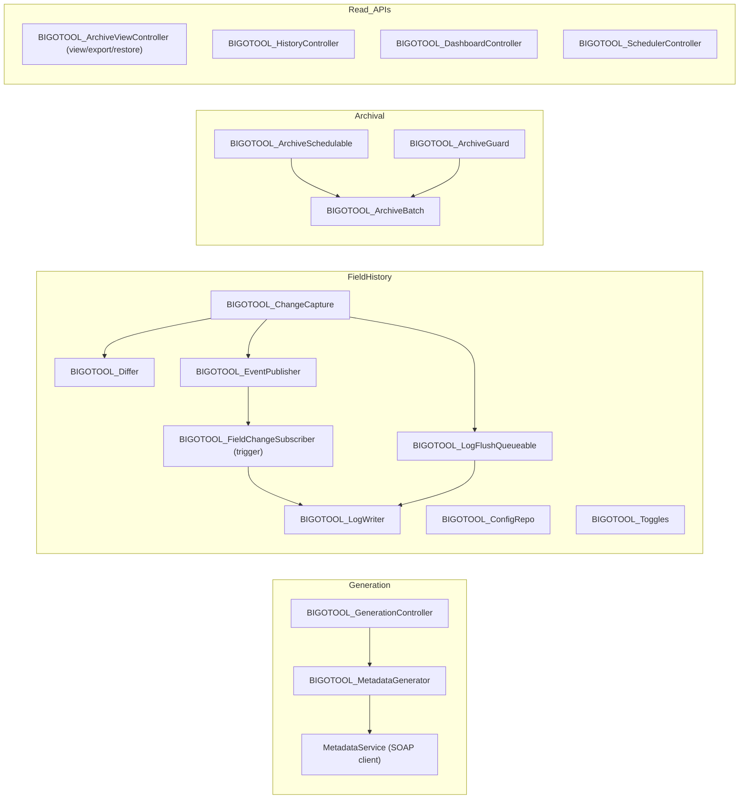
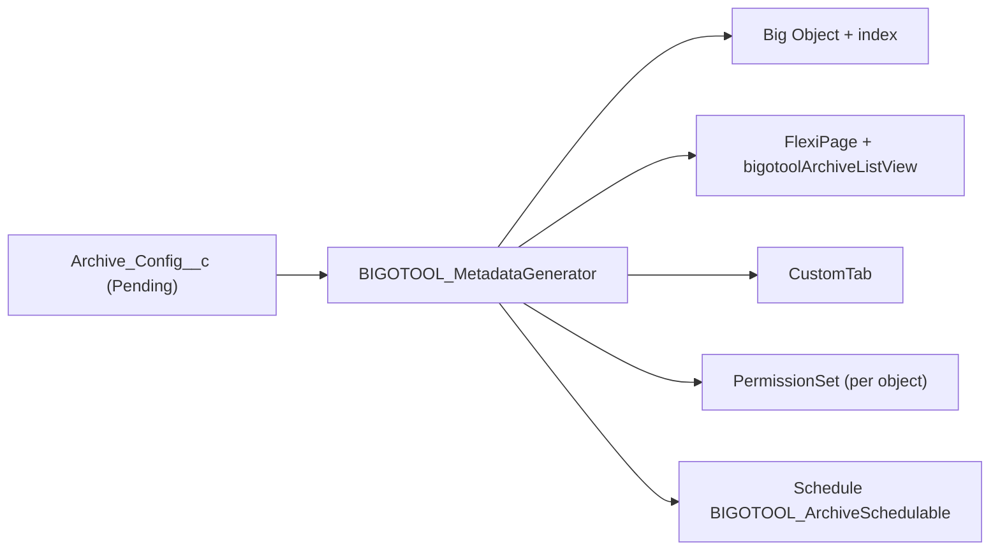
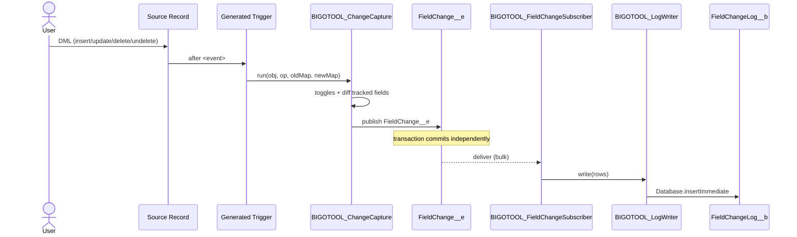
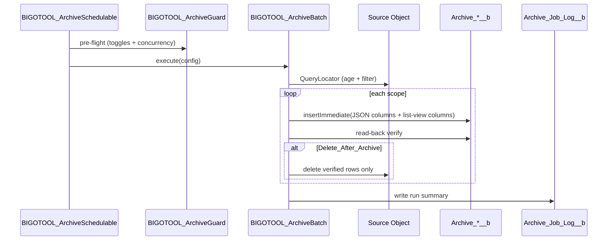
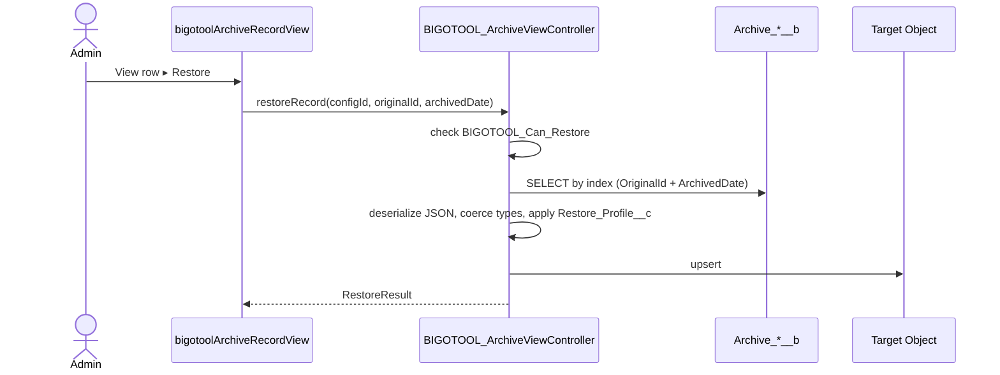
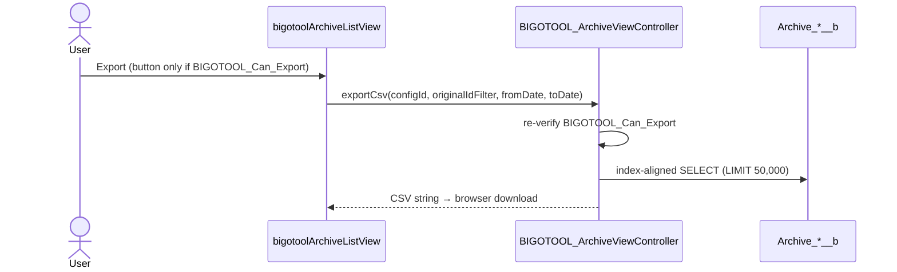

# Big Object Tooling (BIGOTOOL) — Architecture

**Package name:** Big Object Tooling (BIGOTOOL)
**Platform:** Salesforce Platform (Lightning Experience, API v67.0)
**Purpose:** An admin tooling package that lets you **archive** standard/custom object data into **Big Objects**, **log field change history** into a universal Big Object, and **restore** archived records — driven by **point-and-click LWC wizards** that **auto-generate** the archive Big Object, its viewer page, tab and access permission set via the Metadata API.

> This document describes what is actually implemented in this repository. Component, class, object, field and index names below match the source under `force-app/main/default`.

---

## Table of Contents

1. [Solution Overview](#1-solution-overview)
2. [High-Level Architecture](#2-high-level-architecture)
3. [Big Object Schemas](#3-big-object-schemas)
4. [Configuration Data Model](#4-configuration-data-model)
5. [Apex Components](#5-apex-components)
6. [Auto-Generation Engine](#6-auto-generation-engine)
7. [User Interface (LWC)](#7-user-interface-lwc)
8. [Lightning App](#8-lightning-app)
9. [Data Flow Sequences](#9-data-flow-sequences)
10. [Security Model](#10-security-model)
11. [Scale & Big Object Best Practices](#11-scale--big-object-best-practices)
12. [Metadata Inventory](#12-metadata-inventory)

---

## 1. Solution Overview

### 1.1 Capabilities

| Capability                  | Description                                                                                                                                                                             | Storage                                                      |
| --------------------------- | --------------------------------------------------------------------------------------------------------------------------------------------------------------------------------------- | ------------------------------------------------------------ |
| **Field History Logging**   | Capture old/new values of selected fields on selected objects (beyond the native 20-field / 18-month limit).                                                                            | `FieldChangeLog__b` (one shared Big Object for all objects)  |
| **Data Archival**           | Move aged / criteria-matched records out of a source object into a generated Big Object to reduce storage.                                                                              | One generated Big Object per config (e.g. `Archive_Case__b`) |
| **Data Restore**            | Rehydrate a single archived row back into the source (or a target) object, applying a restore profile.                                                                                  | Source / target object                                       |
| **CSV Export**              | Export archived rows (optionally filtered by original Id and/or archived-date range) to CSV. **Synchronous**, capped at **50,000 rows**, gated by the `BIGOTOOL_Can_Export` permission. | CSV string returned to the browser                           |
| **Configuration Wizards**   | Guided, no-code setup of what/when/how to archive and which fields to log.                                                                                                              | Custom objects (standard DML)                                |
| **Auto-Generation**         | Generate the archive Big Object, Lightning page, tab and permission set from a config record.                                                                                           | Metadata API (via `MetadataService`)                         |
| **Unified App + Dashboard** | One Lightning app to configure, monitor and browse archived/logged data.                                                                                                                | Lightning App + LWC                                          |

### 1.2 Design Principles

- **Config over code** — admins create configuration records; runtime metadata is generated, not hand-written.
- **Two parallel pipelines** — _Archival_ (`Archive_Config__c` → generated `Archive_*__b`) and _Field History_ (`Field_Log_Config__c` → shared `FieldChangeLog__b`).
- **Big Object index-first** — every query path follows the composite index left-to-right.
- **Asynchronous by default** — field logging decouples through a platform event; archival runs in Batch Apex.
- **Reversible & safe** — archival can delete the source only after a verified Big Object write; restore is always available.

### 1.3 Why Big Objects

Big Objects store **billions of records** with horizontal scale, but:

- Are queried only via **SOQL on the defined index** (left-to-right) or **Async SOQL**.
- Have **no triggers, no standard UI, no reports**.
- Are written via **`Database.insertImmediate()`** and are **immutable** (re-insert on the same index = overwrite); writes are **eventually consistent**.

The toolkit hides this complexity behind wizards, a generated viewer page, and a shared history timeline.

---

## 2. High-Level Architecture



### 2.1 Three logical planes

1. **Config plane** — Wizards write declarative intent into custom-object records (standard DML).
2. **Generation plane** — `BIGOTOOL_GenerationController` → `BIGOTOOL_MetadataGenerator` reads an `Archive_Config__c` and emits the archive Big Object, Lightning page, tab and permission set through the Metadata API.
3. **Runtime plane** — Generated triggers + platform event move field history; Batch Apex moves archived rows; LWC viewers read the data back.

---

## 3. Big Object Schemas

### 3.1 `FieldChangeLog__b` — Universal Field History

A **single shared** Big Object captures field history for **all** configured objects.

| Field API Name       | Type                                 | Index Position |
| -------------------- | ------------------------------------ | -------------- |
| `ObjectApiName__c`   | Text                                 | **1 (ASC)**    |
| `RecordId__c`        | Text                                 | **2 (ASC)**    |
| `ChangedDateTime__c` | Date/Time                            | **3 (DESC)**   |
| `Sequence__c`        | Number                               | **4 (ASC)**    |
| `FieldApiName__c`    | Text                                 | —              |
| `FieldLabel__c`      | Text                                 | —              |
| `OldValue__c`        | Long Text                            | —              |
| `NewValue__c`        | Long Text                            | —              |
| `ChangedByUserId__c` | Text                                 | —              |
| `ChangeType__c`      | Text (Create/Update/Delete/Undelete) | —              |
| `TransactionId__c`   | Text                                 | —              |

**Index (`FieldChangeLogIndex`):** `ObjectApiName__c, RecordId__c, ChangedDateTime__c DESC, Sequence__c`

This leading key makes the most common query — "history for _this_ record, newest first" — hit the index directly:

```sql
SELECT FieldLabel__c, OldValue__c, NewValue__c, ChangedDateTime__c, ChangedByUserId__c
FROM FieldChangeLog__b
WHERE ObjectApiName__c = :objName AND RecordId__c = :recId
ORDER BY ChangedDateTime__c DESC, Sequence__c DESC
```

### 3.2 `Archive_*__b` — Generated Per-Config Archive Big Object

`BIGOTOOL_MetadataGenerator` creates one Big Object per `Archive_Config__c`. Rather than mirroring every source field, the full record snapshot is stored as JSON split across three Long Text columns; only the admin-flagged **list-view** fields become their own queryable columns.

| Field API Name       | Type                | Role                                                              | Index Position |
| -------------------- | ------------------- | ----------------------------------------------------------------- | -------------- |
| `OriginalId__c`      | Text(18), required  | Source record Id (restore key)                                    | **1 (ASC)**    |
| `ArchivedDate__c`    | Date/Time, required | When archived                                                     | **2 (DESC)**   |
| `FieldData__c`       | Long Text           | Primary JSON snapshot of the record                               | —              |
| `LongTextData__c`    | Long Text           | Overflow for long-text field values                               | —              |
| `OverflowData__c`    | Long Text           | Additional overflow chunk                                         | —              |
| `<ListViewField>__c` | Text(255)           | One column per flagged list-view field, for direct display/filter | —              |

**Index (`Archive Index`):** `OriginalId__c ASC, ArchivedDate__c DESC`

> **Hybrid storage:** the JSON columns are the source of truth for the record viewer and restore (lossless even if the source schema drifts); the flat Text(255) columns exist only so the list view can show/sort columns without parsing JSON.

### 3.3 `Archive_Job_Log__b` — Operational Audit

Immutable run history for archive jobs, surfaced on the dashboard.

| Field                                                                                      | Type      | Index        |
| ------------------------------------------------------------------------------------------ | --------- | ------------ |
| `ConfigName__c`                                                                            | Text      | **1 (ASC)**  |
| `RunDateTime__c`                                                                           | Date/Time | **2 (DESC)** |
| `JobType__c`                                                                               | Text      | **3 (ASC)**  |
| `Status__c`, `RecordsProcessed__c`, `RecordsFailed__c`, `ErrorSummary__c`, `AsyncJobId__c` | —         | —            |

**Index (`ArchiveJobLogIndex`):** `ConfigName__c, RunDateTime__c DESC, JobType__c`

---

## 4. Configuration Data Model

Configuration uses **custom objects** (runtime CRUD via wizards) for structure, and a **hierarchy custom setting** for instant on/off toggles.

### 4.1 `Archive_Config__c` — Object Archival Definition

| Field                       | Type      | Purpose                                                           |
| --------------------------- | --------- | ----------------------------------------------------------------- |
| `Source_Object__c`          | Text      | API name of object to archive                                     |
| `Big_Object_Api_Name__c`    | Text      | Generated BO API name (e.g. `Archive_Case__b`)                    |
| `Is_Active__c`              | Checkbox  | Enable this config                                                |
| `Criteria_Type__c`          | Picklist  | `Age` / `SOQL_Filter` / `Both`                                    |
| `Age_Field__c`              | Text      | Date field used for age criteria                                  |
| `Age_Threshold_Days__c`     | Number    | Archive when older than N days                                    |
| `Filter_Logic__c`           | Long Text | SOQL `WHERE` fragment                                             |
| `Delete_After_Archive__c`   | Checkbox  | Delete source rows after a verified write                         |
| `Batch_Size__c`             | Number    | Batch scope size                                                  |
| `Schedule_Cron__c`          | Text      | CRON expression for the scheduled job                             |
| `Schedule_Paused__c`        | Checkbox  | Pause the schedule without deleting it                            |
| `Last_Archive_Run__c`       | Date/Time | Last run timestamp                                                |
| `Last_Run_Status__c`        | Text      | Last run outcome                                                  |
| `Total_Records_Archived__c` | Number    | Cumulative archived count                                         |
| `List_View_Fields__c`       | Long Text | Legacy CSV of list-view fields (superseded by `Archive_Field__c`) |
| `Generation_Status__c`      | Picklist  | `Pending` / `Generated` / `Error`                                 |

### 4.2 `Archive_Field__c` — Field Selection (child of `Archive_Config__c`)

Master-detail child describing which source fields are captured and which are flattened into list-view columns.

| Field               | Type          | Purpose                                             |
| ------------------- | ------------- | --------------------------------------------------- |
| `Archive_Config__c` | Master-Detail | Parent config                                       |
| `Field_API_Name__c` | Text          | Source field captured in the snapshot               |
| `Field_Label__c`    | Text          | Display label                                       |
| `Field_Type__c`     | Text          | Source field type                                   |
| `Is_List_View__c`   | Checkbox      | Materialize this field as its own Big Object column |

### 4.3 `Restore_Profile__c` — Restore Behavior (child of `Archive_Config__c`)

Master-detail child that defines how a restore is applied.

| Field                  | Type          | Purpose                                                |
| ---------------------- | ------------- | ------------------------------------------------------ |
| `Archive_Config__c`    | Master-Detail | Parent config                                          |
| `Target_Object__c`     | Text          | Object to restore into (defaults to the source object) |
| `Match_Field__c`       | Text          | Dedupe / upsert key                                    |
| `On_Conflict__c`       | Picklist      | `Skip` / `Overwrite` / `Clone`                         |
| `Reparent_Owner__c`    | Checkbox      | Restore the original owner                             |
| `Bypass_Automation__c` | Checkbox      | Suppress automation during restore DML                 |

### 4.4 `Field_Log_Config__c` — Object-Level Field History Definition

| Field                                                                               | Type     | Purpose                                                     |
| ----------------------------------------------------------------------------------- | -------- | ----------------------------------------------------------- |
| `Source_Object__c` / `Source_Object_Label__c`                                       | Text     | Object to track                                             |
| `Is_Active__c`                                                                      | Checkbox | Enable logging for the object                               |
| `Async_Mode__c`                                                                     | Picklist | `PlatformEvent` (recommended) / `Queueable` / `Synchronous` |
| `Log_On_Create__c` / `Log_On_Update__c` / `Log_On_Delete__c` / `Log_On_Undelete__c` | Checkbox | Event scope                                                 |
| `Retention_Days__c`                                                                 | Number   | TTL hint for purge                                          |
| `Trigger_Generated__c`                                                              | Checkbox | Set once the trigger has been created                       |

### 4.5 `Field_Log_Field__c` — Field Selection (child of `Field_Log_Config__c`)

| Field                                  | Type          | Purpose                                             |
| -------------------------------------- | ------------- | --------------------------------------------------- |
| `Field_Log_Config__c`                  | Master-Detail | Parent config                                       |
| `Field_Api_Name__c` / `Field_Label__c` | Text          | Field to track                                      |
| `Track_Old_New__c`                     | Checkbox      | Capture both old and new values                     |
| `Mask_Value__c`                        | Checkbox      | Store a SHA-256 hash instead of the raw value (PII) |

### 4.6 `BIGOTOOL_Settings__c` — Hierarchy Custom Setting

| Field                      | Type     | Purpose                               |
| -------------------------- | -------- | ------------------------------------- |
| `Master_Switch__c`         | Checkbox | Global kill-switch for all automation |
| `Logging_Enabled__c`       | Checkbox | Org-wide field-logging toggle         |
| `Archiving_Enabled__c`     | Checkbox | Org-wide archiving toggle             |
| `Max_Batch_Concurrency__c` | Number   | Throttle simultaneous archive batches |
| `Debug_Mode__c`            | Checkbox | Verbose logging                       |

### 4.7 `FieldChange__e` — Platform Event

Mirrors the `FieldChangeLog__b` payload fields (`ObjectApiName__c`, `RecordId__c`, `FieldApiName__c`, `FieldLabel__c`, `OldValue__c`, `NewValue__c`, `ChangeType__c`, `ChangedDateTime__c`, `ChangedByUserId__c`, `TransactionId__c`, `Sequence__c`). Used to decouple Big Object writes from the originating transaction.

---

## 5. Apex Components

### 5.1 Component map



### 5.2 Field-history runtime

A **thin trigger** on each tracked source object delegates to the reusable handler `BIGOTOOL_ChangeCapture`. The trigger source is **generated for the admin to deploy** via the `bigotoolGenerateTriggerCode` component (it is not auto-deployed by the Metadata API).

```apex
// Example generated trigger (admin deploys this on the source object)
trigger AccountFieldLogTrigger on Account(after insert, after update, after delete, after undelete) {
  BIGOTOOL_ChangeCapture.run('Account', Trigger.operationType, Trigger.oldMap, Trigger.newMap);
}
```

`BIGOTOOL_ChangeCapture.run(...)`:

1. Gates on `BIGOTOOL_Toggles` (master switch + `Logging_Enabled__c` + the object's `Field_Log_Config__c`).
2. Reads tracked fields via `BIGOTOOL_ConfigRepo` and diffs `oldMap`/`newMap` via `BIGOTOOL_Differ` into `FieldChangeLog__b` rows (masking values flagged `Mask_Value__c`).
3. Routes by `Async_Mode__c`:
   - **PlatformEvent** → `BIGOTOOL_EventPublisher.publish(...)` fires `FieldChange__e`; the `BIGOTOOL_FieldChangeSubscriber` trigger persists rows via `BIGOTOOL_LogWriter.write(...)` (`insertImmediate`) after the transaction commits.
   - **Queueable** → `BIGOTOOL_LogFlushQueueable` writes asynchronously through `BIGOTOOL_LogWriter`.
   - **Synchronous** → `BIGOTOOL_LogWriter.write(...)` runs inline.

> **Why a platform event by default:** Big Object writes use `insertImmediate`, which cannot safely participate in a transaction that may roll back. The event decouples the write so a logging failure never blocks the user's save.

### 5.3 Archival runtime

`BIGOTOOL_ArchiveBatch` (`Database.Batchable`, `Database.Stateful`) is driven by an `Archive_Config__c`:

- `start()` builds the source query from age and/or filter criteria.
- `execute()` serialises each record to the JSON columns, writes to the generated Big Object via `Database.insertImmediate`, and — when `Delete_After_Archive__c` is set — deletes source rows **only after a verified read-back**.
- `finish()` writes a run summary to `Archive_Job_Log__b`.

`BIGOTOOL_ArchiveSchedulable` is the `Schedulable` wrapper that launches the batch. `BIGOTOOL_ArchiveGuard` performs a pre-flight check (toggles + concurrency vs. the flex-queue ceiling) before a batch is queued.

### 5.4 Restore runtime

Restore is **synchronous and single-record**, exposed by `BIGOTOOL_ArchiveViewController.restoreRecord(configId, originalId, archivedDate)`:

1. Verifies the `BIGOTOOL_Can_Restore` custom permission (also surfaced to the UI via `canRestore()`).
2. Reads the archived row by index, deserialises the JSON snapshot and coerces values back to native field types.
3. Applies the related `Restore_Profile__c` (target object, match field, `On_Conflict__c`, owner reparenting, automation bypass) and upserts into the target object.

### 5.5 Generation engine

`BIGOTOOL_GenerationController.generate(configId)` validates the config is `Pending`, calls `BIGOTOOL_MetadataGenerator.generate(config)`, then flips `Generation_Status__c` to `Generated` or `Error`. `BIGOTOOL_MetadataGenerator` uses the bundled **`MetadataService`** SOAP client (Salesforce Labs apex-mdapi) and authenticates with the session Id exposed by the `BIGOTOOL_SessionId` Visualforce page; the `BIGOTOOL_Metadata_API` Remote Site Setting must point at the org's My Domain.

---

## 6. Auto-Generation Engine

For an `Archive_Config__c`, `BIGOTOOL_MetadataGenerator.generate()` creates, in order:

| Step | Metadata Type               | Content                                                                                                                                                                                      |
| ---- | --------------------------- | -------------------------------------------------------------------------------------------------------------------------------------------------------------------------------------------- |
| 1    | `CustomObject` (Big Object) | `Archive_*__b` with `OriginalId__c`, `ArchivedDate__c`, the three JSON columns, a Text(255) column per list-view field, and the `Archive Index` (`OriginalId__c ASC, ArchivedDate__c DESC`). |
| 2    | `FlexiPage` (App Page)      | Hosts the generic `bigotoolArchiveListView` LWC bound to the new Big Object.                                                                                                                 |
| 3    | `CustomTab`                 | A Lightning-page tab (`Archive <Object>`) exposing the FlexiPage — Big Objects cannot back object tabs directly.                                                                             |
| 4    | `PermissionSet`             | A dedicated per-object set granting read on the Big Object (object + FLS on the data/list-view columns) and tab visibility.                                                                  |
| 5    | Scheduled job               | Schedules `BIGOTOOL_ArchiveSchedulable` from the config's CRON.                                                                                                                              |



> Each step is wrapped defensively: a failure in the tab, permission set or schedule step is recorded as a warning rather than aborting the whole generation. Metadata API callouts must complete **before** any DML in the same transaction.

---

## 7. User Interface (LWC)

All UI is **Lightning Web Components** using SLDS. Wizards use the `lightning-progress-indicator` path pattern.

| Component                         | Purpose                                                                                                                               | Apex backing                        |
| --------------------------------- | ------------------------------------------------------------------------------------------------------------------------------------- | ----------------------------------- |
| **`bigotoolArchiveWizard`**       | 6-step archive setup: Object → Criteria → Fields → Schedule → Restore → Review.                                                       | `BIGOTOOL_ArchiveWizardController`  |
| **`bigotoolFieldLogWizard`**      | 5-step field-history setup: Object → Fields → Events & Mode → Retention → Review.                                                     | `BIGOTOOL_FieldLogWizardController` |
| **`bigotoolArchiveGenerator`**    | Modal that triggers Big Object/page/tab/permission-set generation for a config.                                                       | `BIGOTOOL_GenerationController`     |
| **`bigotoolArchiveScheduler`**    | Archive_Config record-page component: schedule state, last run, cumulative count; start / pause / delete schedule, run now.           | `BIGOTOOL_SchedulerController`      |
| **`bigotoolArchiveListView`**     | Generic, paginated list view over any generated Big Object; date-range & original-Id filters; CSV export.                             | `BIGOTOOL_ArchiveViewController`    |
| **`bigotoolArchiveRecordView`**   | Dynamic detail layout for one archived row (renders the JSON snapshot); Restore action.                                               | `BIGOTOOL_ArchiveViewController`    |
| **`bigotoolHistoryTimeline`**     | Field-history viewer for any record (timeline or table mode); field/type/user filters, cursor pagination.                             | `BIGOTOOL_HistoryController`        |
| **`bigotoolDashboard`**           | App home: config coverage, job-run history, and org-level toggles (`Master_Switch__c`, `Archiving_Enabled__c`, `Logging_Enabled__c`). | `BIGOTOOL_DashboardController`      |
| **`bigotoolGenerateTriggerCode`** | Displays the generated field-history trigger source for the admin to deploy.                                                          | uiapi GraphQL + `updateRecord`      |
| **`bigotoolSearchablePicklist`**  | Reusable searchable picklist used by the wizards.                                                                                     | none                                |

### 7.1 CSV Export

Export is provided by `BIGOTOOL_ArchiveViewController.exportCsv(configId, originalIdFilter, fromDate, toDate)` and surfaced as an action on `bigotoolArchiveListView`:

- The button renders only when the user holds **`BIGOTOOL_Can_Export`** (`canExport()`), re-verified server-side before any query runs.
- The query is **index-aligned** and **synchronous**, capped at **`MAX_EXPORT_ROWS = 50,000`** rows.
- The CSV is returned as a string for an immediate browser download. (There is no asynchronous/Bulk-API or Files-based export pipeline.)

---

## 8. Lightning App

**App:** _Big Object Tooling_ (`Big_Object_Tooling`, Lightning app, standard navigation). Default tabs:

- **Dashboard** (`BIGOTOOL_Dashboard` tab → `bigotoolDashboard`) — KPIs, job history, org toggles.
- **Archive Configurations** (`Archive_Config__c` tab) — create/manage archive configs and launch generation.
- **Field Log Configurations** (`Field_Log_Config__c` tab) — create/manage field-history configs.

Each generated archive Big Object gets its **own tab** (created by the generation engine). Add those tabs to the app's navigation as needed.

---

## 9. Data Flow Sequences

### 9.1 Field change → Big Object (platform-event mode)



### 9.2 Scheduled archive with safe delete



### 9.3 On-demand restore (single record)



### 9.4 CSV export (synchronous)



---

## 10. Security Model

| Concern                 | Approach                                                                                                                                                                          |
| ----------------------- | --------------------------------------------------------------------------------------------------------------------------------------------------------------------------------- |
| **Big Object access**   | `FieldChangeLog__b` / `Archive_Job_Log__b` read is granted by the shipped permission sets; each generated archive Big Object is read-granted by its own generated permission set. |
| **Sharing**             | History/archive read controllers run `without sharing` because Big Objects don't enforce record-level sharing; visibility is controlled by permission-set assignment.             |
| **Restore authority**   | Gated by the `BIGOTOOL_Can_Restore` custom permission (UI button + server re-check).                                                                                              |
| **Export authority**    | Gated by the `BIGOTOOL_Can_Export` custom permission (UI button + server re-check); granted via `BIGOTOOL_Data_Exporter`.                                                         |
| **Configure authority** | Gated by the `BIGOTOOL_Can_Configure` custom permission, held by configurator/admin sets.                                                                                         |
| **PII**                 | Fields flagged `Mask_Value__c` are stored as a SHA-256 hash; raw values are never written.                                                                                        |
| **Toggles**             | `Master_Switch__c` (hierarchy CS) instantly halts all automation.                                                                                                                 |

### 10.1 Permission Sets

| Permission Set                | Intended user           | Grants                                                                                                                                                                                                                    |
| ----------------------------- | ----------------------- | ------------------------------------------------------------------------------------------------------------------------------------------------------------------------------------------------------------------------- |
| **`BIGOTOOL_Administrator`**  | Admins / package owners | Everything: all controllers/generation classes, full CRUD on config objects, read on the audit/history Big Objects, and the `BIGOTOOL_Can_Configure` / `BIGOTOOL_Can_Restore` / `BIGOTOOL_Can_Export` custom permissions. |
| **`BIGOTOOL_Configurator`**   | Power admins            | Wizard + generation classes, CRUD on config objects, `BIGOTOOL_Can_Configure`; all config tabs.                                                                                                                           |
| **`BIGOTOOL_Archive_Viewer`** | Business users          | Read access to the dashboard and `BIGOTOOL_ArchiveViewController`; read on `Archive_Job_Log__b`. **Which** archive Big Objects a user sees is governed by assigning the relevant generated per-object permission sets.    |
| **`BIGOTOOL_History_Viewer`** | Support / audit         | Read access to the dashboard and `BIGOTOOL_HistoryController`; read on `FieldChangeLog__b`.                                                                                                                               |
| **`BIGOTOOL_Data_Exporter`**  | Export-cleared users    | Add-on granting `BIGOTOOL_Can_Export`; stack on a viewer set.                                                                                                                                                             |

**Capability matrix:**

| Capability                             | Administrator | Configurator | Archive_Viewer | History_Viewer | Data_Exporter |
| -------------------------------------- | :-----------: | :----------: | :------------: | :------------: | :-----------: |
| View dashboard                         |      ✅       |      ✅      |       ✅       |       ✅       |      ✅       |
| View field history                     |      ✅       |      —       |       —        |       ✅       |       —       |
| View archive records                   |      ✅       |      —       |       ✅       |       —        |       —       |
| Configure via wizards / run generation |      ✅       |      ✅      |       —        |       —        |       —       |
| Restore archived data                  |      ✅       |      —       |       —        |       —        |       —       |
| Export to CSV                          |      ✅       |      —       |       —        |       —        |  ✅ (add-on)  |

### 10.2 Generated per-object permission sets

When a config is generated, `BIGOTOOL_MetadataGenerator` creates a dedicated permission set granting read on that specific `Archive_*__b` Big Object (object permission + field-level read on the data and list-view columns) and visibility of its generated tab. Assign these sets to control exactly which archives a user can browse; bundle them into a Permission Set Group per persona for scale.

---

## 11. Scale & Big Object Best Practices

- **Query left-to-right on the index.** Viewers always supply the leading index fields; non-indexed filtering is avoided.
- **Writes are immutable & eventually consistent.** Re-insert on the same index overwrites; the archive batch only deletes source rows after a verified read-back; `Sequence__c` keeps same-instant history rows distinct.
- **Chunk writes.** `insertImmediate` is bounded (~10,000 rows/transaction); archival runs in Batch Apex and respects `Max_Batch_Concurrency__c`.
- **Decouple logging.** Prefer `PlatformEvent` mode to keep Big Object writes out of the user's transaction.
- **Export limits.** CSV export is synchronous and capped at 50,000 rows — for larger extracts, narrow by original Id / date range or use Async SOQL / Bulk API outside the package.
- **Generation is callout-first.** Metadata API callouts must precede DML; index fields are fixed at creation, so changing the index requires a new Big Object.

---

## 12. Metadata Inventory

**Big Objects:** `FieldChangeLog__b`, `Archive_Job_Log__b`, `Archive_*__b` (generated, one per config).

**Custom Objects:** `Archive_Config__c`, `Archive_Field__c` (MD child), `Restore_Profile__c` (MD child), `Field_Log_Config__c`, `Field_Log_Field__c` (MD child).

**Custom Setting:** `BIGOTOOL_Settings__c` (Hierarchy).

**Platform Event:** `FieldChange__e`.

**Apex — runtime:** `BIGOTOOL_Toggles`, `BIGOTOOL_ConfigRepo`, `BIGOTOOL_ChangeCapture`, `BIGOTOOL_Differ`, `BIGOTOOL_EventPublisher`, `BIGOTOOL_LogWriter`, `BIGOTOOL_LogFlushQueueable`, `BIGOTOOL_ArchiveBatch`, `BIGOTOOL_ArchiveSchedulable`, `BIGOTOOL_ArchiveGuard`.

**Apex — controllers / read APIs:** `BIGOTOOL_ArchiveWizardController`, `BIGOTOOL_FieldLogWizardController`, `BIGOTOOL_GenerationController`, `BIGOTOOL_SchedulerController`, `BIGOTOOL_ArchiveViewController` (view + export + restore), `BIGOTOOL_HistoryController`, `BIGOTOOL_DashboardController`.

**Apex — generation:** `BIGOTOOL_MetadataGenerator`, `MetadataService` (Salesforce Labs apex-mdapi SOAP client), `BIGOTOOL_MetadataServiceMock` (test).

**Triggers:** `BIGOTOOL_FieldChangeSubscriber` (on `FieldChange__e`); plus admin-deployed per-object field-history triggers generated by `bigotoolGenerateTriggerCode`.

**LWC:** `bigotoolArchiveWizard`, `bigotoolFieldLogWizard`, `bigotoolArchiveGenerator`, `bigotoolArchiveScheduler`, `bigotoolArchiveListView`, `bigotoolArchiveRecordView`, `bigotoolHistoryTimeline`, `bigotoolDashboard`, `bigotoolGenerateTriggerCode`, `bigotoolSearchablePicklist`.

**Other metadata:** Lightning app `Big_Object_Tooling`; tabs `BIGOTOOL_Dashboard`, `Archive_Config__c`, `Field_Log_Config__c`; FlexiPage `BIGOTOOL_Dashboard`; Visualforce page `BIGOTOOL_SessionId`; Remote Site Setting `BIGOTOOL_Metadata_API`.

**Permission Sets:** `BIGOTOOL_Administrator`, `BIGOTOOL_Configurator`, `BIGOTOOL_Archive_Viewer`, `BIGOTOOL_History_Viewer`, `BIGOTOOL_Data_Exporter` (+ generated per-object archive sets). **Custom permissions:** `BIGOTOOL_Can_Configure`, `BIGOTOOL_Can_Restore`, `BIGOTOOL_Can_Export`.

---

> **Document status:** Reflects the implementation in this repository (API v67.0). Generated metadata (Big Objects, tabs, permission sets) is created at runtime via the Metadata API and is not checked into source.
