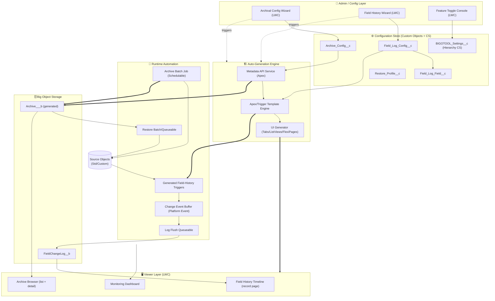
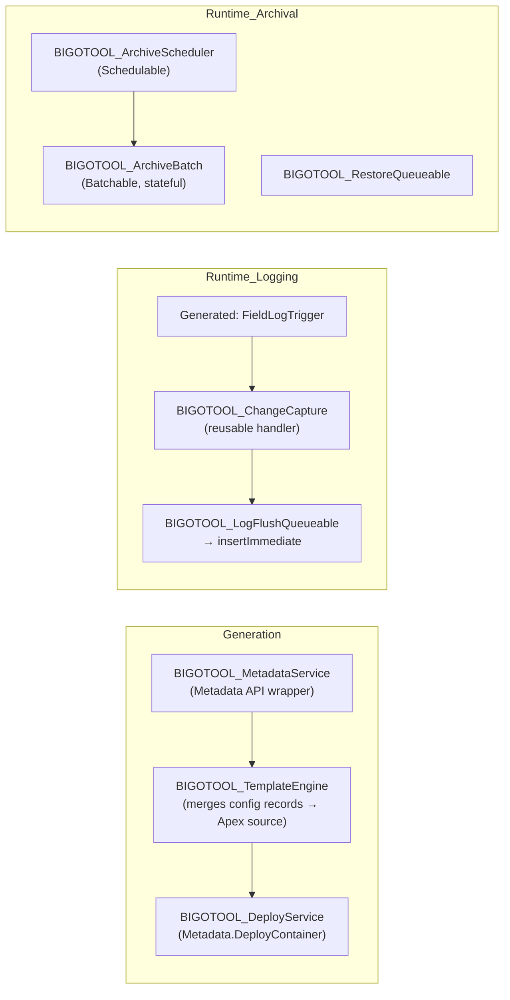
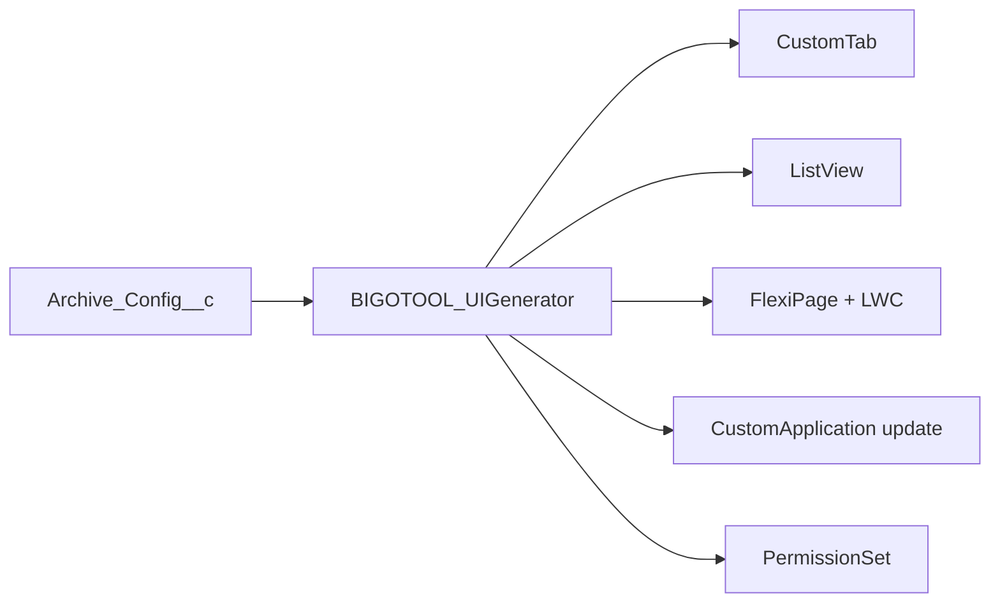
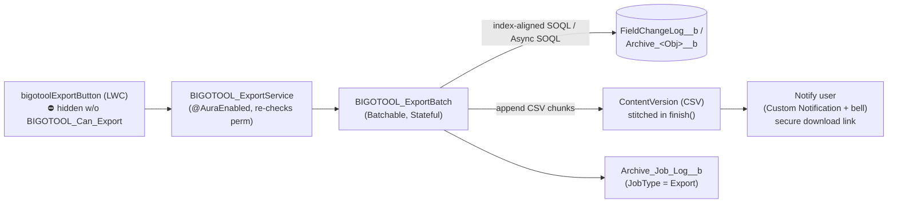
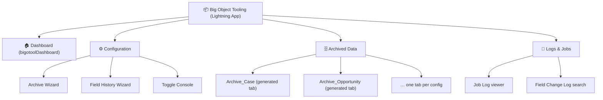
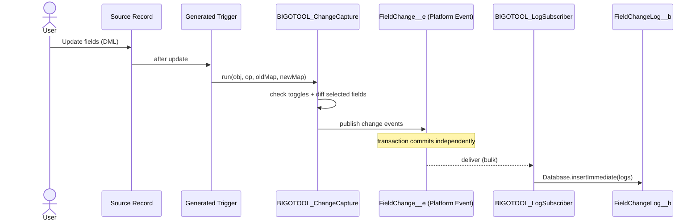
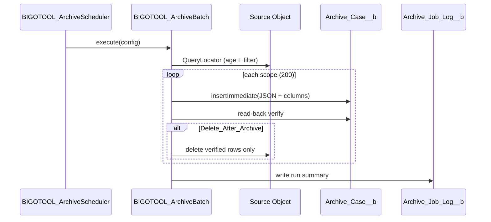
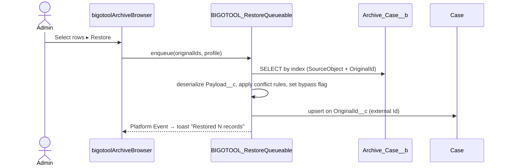

# Big Object Tooling Package — Architecture & UI/UX Design

**Package name:** Big Object Tooling (BIGOTOOL)
**Namespace (suggested):** `bigotool`
**Platform:** Salesforce Platform (Lightning Experience, API v67.0)
**Purpose:** A managed-style tooling package that lets admins **archive** standard/custom object data into **Big Objects**, **log field change history** into Big Objects, and **restore** archived data — all driven by **point-and-click wizards** that **auto-generate** the Big Objects, Apex, triggers, batch jobs, tabs, list views, and record pages required.

---

## Table of Contents

1. [Solution Overview](#1-solution-overview)
2. [High-Level Architecture Flow](#2-high-level-architecture-flow)
3. [Big Object Schema Definitions](#3-big-object-schema-definitions)
4. [Configuration Design (Custom Objects & Custom Settings)](#4-configuration-design-custom-objects--custom-settings)
5. [Automation Components (Apex, Triggers, Batch, Metadata API)](#5-automation-components)
6. [Auto-Generation Engine (Tabs, List Views, Record Pages)](#6-auto-generation-engine)
7. [UI/UX Design — Wizards & Viewers](#7-uiux-design)
8. [App Framework — Unified Lightning App](#8-app-framework)
9. [Data Flow Sequences](#9-data-flow-sequences)
10. [Security Model](#10-security-model)
11. [Performance, Scale & Data Volume Best Practices](#11-performance-scale--data-volume-best-practices)
12. [Implementation Roadmap](#12-implementation-roadmap)
13. [Appendix — Metadata Inventory](#13-appendix--metadata-inventory)

---

## 1. Solution Overview

### 1.1 Capabilities

| Capability | Description | Storage |
|---|---|---|
| **Field History Logging** | Capture old/new values of selected fields on selected objects (beyond the 20-field / 18-month native limit). | `FieldChangeLog__b` Big Object |
| **Data Archival** | Move aged/criteria-matched records out of transactional objects into Big Objects to reduce storage & improve performance. | One generated Big Object per source object (e.g., `Archive_Case__b`) |
| **Data Restore** | Rehydrate archived rows back into the source object (or a clone) on demand. | Source object |
| **Data Export (CSV)** | Export a single record's full field history, or an entire object's archive, to CSV. Bulk-safe for **millions** of rows; gated by an export permission set. | Salesforce Files / async download |
| **Configuration Wizards** | Guided, no-code setup of what/when/how to archive and log. | Custom Objects + Custom Settings |
| **Auto-Generation** | Generate Big Objects, Apex, triggers, batch jobs, tabs, list views, record pages from config. | Metadata API (Tooling/Metadata) |
| **Unified Viewer App** | Single Lightning app to configure, monitor, and browse archived/logged data. | Lightning App + LWC |

### 1.2 Design Principles

- **Config over code** — everything an admin does is captured as configuration records (custom objects); code is generated, never hand-written by the admin.
- **Idempotent generation** — re-running generation reconciles metadata rather than duplicating it.
- **Big Object index-first** — every query path is designed around the Big Object composite index (no arbitrary filtering).
- **Asynchronous by default** — all archive/restore/log-flush operations are bulk-safe and async (Batch/Queueable/Platform Events).
- **Reversible** — archival always supports restore; nothing is destroyed without a verified write.

### 1.3 Why Big Objects

Big Objects store **billions of records** with **horizontal scale**, but trade off flexibility:

- Queried only via **SOQL on the defined index** (in order, left-to-right) or **Async SOQL**.
- **No triggers, no standard UI, no reports** (until surfaced via custom UI / external objects).
- **Insert via `Database.insertImmediate()`** or Bulk API; **no update** — records are immutable (re-insert with same index = upsert/overwrite).
- **Eventually consistent** writes.

The toolkit's job is to **hide this complexity** behind wizards and generated viewers.

---

## 2. High-Level Architecture Flow



### 2.1 Three logical planes

1. **Config plane** — Wizards write declarative intent into custom-object config records + CS.
2. **Generation plane** — A deploy-time/admin-triggered engine reads the config records and emits runtime metadata (Big Objects, Apex, triggers, batch, UI).
3. **Runtime plane** — Generated triggers/batch jobs move data; LWC viewers read it back.

---

## 3. Big Object Schema Definitions

### 3.1 `FieldChangeLog__b` — Universal Field History Big Object

A **single shared** Big Object captures field history for **all** configured objects. The composite index is engineered so the most common query — "show me the history for *this* record, newest first" — hits the index directly.

| Field API Name | Type | Length | Role | Index Position |
|---|---|---|---|---|
| `ObjectApiName__c` | Text | 80 | Source SObject (e.g., `Account`) | **1** |
| `RecordId__c` | Text | 18 | Source record Id | **2** |
| `ChangedDateTime__c` | Date/Time | — | When change occurred (UTC) | **3 (DESC)** |
| `Sequence__c` | Number(18,0) | — | Tie-breaker for same-instant changes | **4** |
| `FieldApiName__c` | Text | 80 | Field that changed | — |
| `FieldLabel__c` | Text | 80 | Display label snapshot | — |
| `OldValue__c` | Long Text | 32768 | Prior value (stringified) | — |
| `NewValue__c` | Long Text | 32768 | New value (stringified) | — |
| `ChangedByUserId__c` | Text | 18 | User who made the change | — |
| `ChangeType__c` | Text | 20 | Create / Update / Delete / Undelete | — |
| `TransactionId__c` | Text | 36 | Groups all field changes in one DML | — |

**Index definition (order matters):**
```
Index: ObjectApiName__c, RecordId__c, ChangedDateTime__c DESC, Sequence__c
```

> **Why one shared BO vs. one-per-object?**
> A shared log avoids Big Object proliferation (limit considerations) and a uniform viewer. The leading `ObjectApiName__c + RecordId__c` keys make per-record queries efficient. Use a **per-object archive** Big Object (below) but a **shared field-log** Big Object.

**Representative SOQL (index-aligned):**
```sql
SELECT FieldLabel__c, OldValue__c, NewValue__c, ChangedDateTime__c, ChangedByUserId__c
FROM FieldChangeLog__b
WHERE ObjectApiName__c = :objName AND RecordId__c = :recId
ORDER BY ChangedDateTime__c DESC, Sequence__c DESC
LIMIT 200
```

### 3.2 `Archive_<Object>__b` — Generated Per-Object Archive Big Object

For each archived source object, the generator creates a dedicated Big Object that **mirrors selected source fields** plus archival metadata. Example for `Case` → `Archive_Case__b`:

| Field API Name | Type | Role | Index Position |
|---|---|---|---|
| `OriginalId__c` | Text(18) | Source record Id (restore key) | **2** |
| `ArchivedDate__c` | Date/Time | When archived | **3 (DESC)** |
| `SourceObject__c` | Text(80) | Redundant label for shared viewer | **1** |
| `OwnerId__c` | Text(18) | Original owner | — |
| `CreatedDateOriginal__c` | Date/Time | Original CreatedDate | — |
| `Payload__c` | Long Text(131072) | **JSON snapshot of full record** (all fields) | — |
| `<MappedField_1>__c ... <MappedField_N>__c` | Mirrors source types | Indexed/queryable columns for list views | — |
| `ArchiveBatchId__c` | Text(18) | AsyncApexJob Id for traceability | — |

**Index definition:**
```
Index: SourceObject__c, OriginalId__c, ArchivedDate__c DESC
```

> **Hybrid storage pattern:** Store a **full JSON snapshot** in `Payload__c` (guarantees lossless restore even if schema drifts), **plus** flatten the admin-selected "list view" fields into typed columns for browsing/filtering. The JSON is the source of truth for restore; the columns are for display.

### 3.3 `Archive_Job_Log__b` — Operational Audit Big Object

Immutable run history for archive/restore/flush jobs (high volume, long retention).

| Field | Type | Index |
|---|---|---|
| `ConfigName__c` Text(80) | 1 |
| `RunDateTime__c` Date/Time DESC | 2 |
| `JobType__c` Text(20) (Archive/Restore/Flush/Export) | 3 |
| `Status__c`, `RecordsProcessed__c`, `RecordsFailed__c`, `ErrorSummary__c` LongText, `AsyncJobId__c` | — |

---

## 4. Configuration Design (Custom Objects & Custom Settings)

**Strategy:** Use **Custom Objects** for *runtime-editable structural config* (what to archive, which fields to log) so wizards can create/update/delete config rows with **standard DML** (no Metadata API deploy needed to add a config), and **Hierarchy Custom Settings** for *environment-specific toggles* (on/off, per-profile overrides) that admins flip instantly. Custom objects also unlock **list views, reports, validation rules, field history, and record-level sharing** on the configuration data itself.

> **Why custom objects instead of CMDT here?** Config rows are created/edited frequently by wizards at runtime and benefit from standard CRUD, SOQL filtering, related lists, and per-record sharing. CMDT would require a Metadata API deploy for every new config row; custom objects let the wizards persist via ordinary `insert`/`update`. Each object below uses a **`Name`** field (Auto Number or Text) as its record identifier and standard `Id` for relationships.

### 4.1 `Archive_Config__c` — Object Archival Definition

| Field | Type | Purpose |
|---|---|---|
| `Name` | Text/Auto Number | Unique config label (e.g., `Case_Archive`) |
| `Source_Object__c` | Text | API name of object to archive |
| `Big_Object_Api_Name__c` | Text | Generated BO (e.g., `Archive_Case__b`) |
| `Is_Active__c` | Checkbox | Master enable for this config |
| `Criteria_Type__c` | Picklist | `Age` / `SOQL_Filter` / `Both` |
| `Age_Field__c` | Text | Date field for age (e.g., `ClosedDate`) |
| `Age_Threshold_Days__c` | Number | Archive when older than N days |
| `Filter_Logic__c` | Long Text | SOQL `WHERE` fragment (validated, parameterized) |
| `Delete_After_Archive__c` | Checkbox | Hard-delete source after verified write |
| `Batch_Size__c` | Number | Scope size (default 200; 1–2000) |
| `Schedule_Cron__c` | Text | CRON expression for scheduled run |
| `List_View_Fields__c` | Long Text | CSV of fields flattened to BO columns |
| `Restore_Profile__c` | Lookup → `Restore_Profile__c` | How to restore |
| `Generation_Status__c` | Picklist | `Pending` / `Generated` / `Error` |

### 4.2 `Field_Log_Config__c` — Object-Level Field History Definition

| Field | Type | Purpose |
|---|---|---|
| `Name` | Text/Auto Number | Config label (e.g., `Account_FieldLog`) |
| `Source_Object__c` | Text | Object to track |
| `Is_Active__c` | Checkbox | Enable logging for object |
| `Log_On_Create__c` / `Log_On_Delete__c` / `Log_On_Undelete__c` | Checkbox | Event scope |
| `Async_Mode__c` | Picklist | `PlatformEvent` / `Queueable` / `Synchronous` |
| `Retention_Days__c` | Number | TTL for purge job (0 = infinite) |
| `Trigger_Generated__c` | Checkbox | Set by generator |

### 4.3 `Field_Log_Field__c` — Field-Level Selection (child)

| Field | Type | Purpose |
|---|---|---|
| `Field_Log_Config__c` | Master-Detail → `Field_Log_Config__c` | Parent |
| `Field_Api_Name__c` | Text | Field to track |
| `Track_Old_New__c` | Checkbox | Capture both values |
| `Mask_Value__c` | Checkbox | PII masking (store hash, not value) |

> **Configurable storage of field-level vs object-level settings** is achieved by the **master-detail** relationship from the parent (`Field_Log_Config__c`, object-level) to the child (`Field_Log_Field__c`, field-level). Master-detail gives cascade delete and roll-up summaries (e.g., count of tracked fields) and cleanly separates the two scopes the requirement calls out.

### 4.4 `Restore_Profile__c` — Restore Behavior

| Field | Type | Purpose |
|---|---|---|
| `Name` | Text/Auto Number | Profile label (e.g., `Case_Default`) |
| `Target_Object__c` | Text | Usually the original object |
| `Match_Field__c` | Text | Dedupe key (default `OriginalId__c` → external Id) |
| `On_Conflict__c` | Picklist | `Skip` / `Overwrite` / `Clone` |
| `Reparent_Owner__c` | Checkbox | Restore original owner vs. running user |
| `Bypass_Automation__c` | Checkbox | Set a static-bypass flag during restore DML |

### 4.5 `BIGOTOOL_Settings__c` — Hierarchy Custom Setting (runtime toggles)

| Field | Type | Purpose |
|---|---|---|
| `Master_Switch__c` | Checkbox | Global kill-switch for all BIGOTOOL automation |
| `Logging_Enabled__c` | Checkbox | Org-wide logging toggle (org/profile/user level) |
| `Archiving_Enabled__c` | Checkbox | Org-wide archiving toggle |
| `Max_Batch_Concurrency__c` | Number | Throttle simultaneous archive jobs |
| `Debug_Mode__c` | Checkbox | Verbose `Archive_Job_Log__b` writes |
| `Visible_Archive_Objects__c` | Text Area (255) | **CSV whitelist** of archive object API names this user/profile may view (e.g., `Archive_Case__b,Archive_Opportunity__b`). **Blank/null = full access to all archive objects.** Non-blank = restricted to only the listed objects. Resolves per user → profile → org via hierarchy. *(Custom Settings cap text at 255 chars — see overflow note below for >~12 objects.)* |
| `Visible_Archive_Objects_2__c` (optional) | Text Area (255) | **Overflow** field, concatenated with the first when a user/profile needs to whitelist more object names than fit in 255 chars. `BIGOTOOL_AccessScope` joins both fields before parsing. |

> **⚠️ Custom Setting field-type limit:** Salesforce **Custom Settings do not support Long Text Area** — the widest available type is **Text Area (255)**. To honor the "single custom setting holds a comma-separated list" design within this limit, `Visible_Archive_Objects__c` is **Text Area (255)** (≈12–15 typical object API names). If a profile/user needs more, add the optional `Visible_Archive_Objects_2__c` overflow field(s); `BIGOTOOL_AccessScope` concatenates them before splitting on commas. If you anticipate whitelisting *many* objects, prefer a separate `Archive_Visibility__c` custom object (one row per user/profile + object) instead — but for the common case the CSV-in-custom-setting approach is simplest and needs no joins.

> **Object-level visibility scoping (additive to `BIGOTOOL_Archive_Viewer`):** the permission set grants the *capability* to read archived data; `Visible_Archive_Objects__c` then *narrows which archive objects* a given user/profile actually sees. See §10.2 for the resolution logic.

> **Custom Object vs CS division of labor:** Custom Objects = *structure & intent* (runtime CRUD via wizards, list views, reports, validation, per-record sharing). Hierarchy CS = *operational switches* (instant on/off per org/profile/user, no record edit). This satisfies "feature toggles per object" (config `Is_Active__c`) **and** "global/contextual toggles" (CS).

---

## 5. Automation Components

### 5.1 Component map



### 5.2 Field-history runtime (generated trigger pattern)

The generator emits a **thin trigger** per object that delegates to a **single reusable handler** (`BIGOTOOL_ChangeCapture`). The handler reads `Field_Log_Config__c`/`Field_Log_Field__c`, diffs `Trigger.oldMap` vs `Trigger.newMap`, and publishes results.

```apex
// GENERATED — do not edit. Source: Field_Log_Config__c[Account]
trigger AccountFieldLogTrigger on Account (after insert, after update, after delete, after undelete) {
    BIGOTOOL_ChangeCapture.run('Account', Trigger.operationType, Trigger.oldMap, Trigger.newMap);
}
```

```apex
public with sharing class BIGOTOOL_ChangeCapture {
    public static void run(String objName, System.TriggerOperation op,
                           Map<Id,SObject> oldMap, Map<Id,SObject> newMap) {
        if (!BIGOTOOL_Toggles.loggingEnabled(objName)) return;          // CS + config gate
        List<FieldChangeLog__b> logs = BIGOTOOL_Differ.diff(objName, op, oldMap, newMap);
        if (logs.isEmpty()) return;
        switch on BIGOTOOL_Toggles.asyncMode(objName) {
            when 'PlatformEvent' { BIGOTOOL_EventPublisher.publish(logs); }     // decouple from txn
            when 'Queueable'     { System.enqueueJob(new BIGOTOOL_LogFlushQueueable(logs)); }
            when else            { Database.insertImmediate(logs); }       // sync (small vol)
        }
    }
}
```

> **Why Platform Event default:** Big Object writes use `insertImmediate` which **cannot run in the same context as standard DML that may roll back**. Publishing a Platform Event (`FieldChange__e`) decouples the write, prevents trigger-side failures from blocking the user's save, and naturally bulkifies via a subscriber.

### 5.3 Archival runtime

```apex
public class BIGOTOOL_ArchiveBatch implements Database.Batchable<SObject>, Database.Stateful {
    private Archive_Config__c cfg;
    private Integer processed = 0, failed = 0;

    public BIGOTOOL_ArchiveBatch(String configName) {
        this.cfg = BIGOTOOL_ConfigRepo.archiveConfig(configName);
    }
    public Database.QueryLocator start(Database.BatchableContext bc) {
        return Database.getQueryLocator(BIGOTOOL_QueryBuilder.archiveQuery(cfg)); // age + filter
    }
    public void execute(Database.BatchableContext bc, List<SObject> scope) {
        List<SObject> bigObjs = BIGOTOOL_Mapper.toBigObject(cfg, scope);  // JSON payload + columns
        List<Database.SaveResult> srs = Database.insertImmediate(bigObjs);
        Set<Id> verified = BIGOTOOL_Verify.confirmWritten(cfg, scope, srs); // read-back check
        if (cfg.Delete_After_Archive__c) {
            delete [SELECT Id FROM ... WHERE Id IN :verified];          // only verified rows
        }
        processed += verified.size();
    }
    public void finish(Database.BatchableContext bc) {
        BIGOTOOL_JobLogger.write(cfg, 'Archive', processed, failed, bc.getJobId());
    }
}
```

**Key safety rule:** Source rows are deleted **only after a verified read-back** from the Big Object (eventual-consistency-safe), preventing data loss.

### 5.4 Restore runtime

`BIGOTOOL_RestoreQueueable` reads `Archive_<Obj>__b` by index (`SourceObject__c + OriginalId__c`), deserializes `Payload__c`, applies `Restore_Profile__c` conflict rules, optionally sets a **bypass flag** so generated logging/automation doesn't re-fire, and upserts on the `OriginalId__c` external Id.

### 5.5 Generation engine (Apex Metadata API)

`BIGOTOOL_MetadataService` uses `Metadata.Operations.enqueueDeployment` with a `Metadata.DeployContainer` to create, from the config records:

- The Big Object (`CustomObject` with `deploymentStatus`, plus `Index` definition).
- Generated columns + index.
- Apex trigger + (if needed) handler config.
- CustomTab, ListView, FlexiPage (record page), and a Lightning App update.

Big Object **definitions are deployed via the Metadata API** (`*.object-meta.xml` with `<indexes>`); the engine writes these to a `DeployContainer`. Configuration records (`Archive_Config__c`, `Field_Log_Config__c`, etc.) are persisted by the wizards with **standard DML** — no Metadata API deploy is needed to add or edit a config, only to generate the runtime metadata it describes.

---

## 6. Auto-Generation Engine

For each archive config, after the Big Object is created, the UI generator produces:

| Artifact | Metadata Type | Content |
|---|---|---|
| **Custom Tab** | `CustomTab` | Tab for `Archive_<Obj>__b` with icon/color |
| **List View(s)** | `ListView` | Default "Recently Archived" sorted by `ArchivedDate__c DESC`, columns = `List_View_Fields__c` |
| **Record Page** | `FlexiPage` | Lightning record page hosting the `bigotoolArchiveDetail` LWC (renders JSON payload + restore button) |
| **App assignment** | `CustomApplication` | Adds tab to the **Big Object Tooling** app |
| **Permission Set** | `PermissionSet` | Updates the shared `BIGOTOOL_Archive_Viewer` (and `BIGOTOOL_Administrator`) sets to grant read on the new BO + tab visibility — no per-object permission sets |

> Because Big Objects have **no native UI**, "record pages" are FlexiPages whose content is **LWC-driven** (Big Objects aren't directly supported by standard record-detail components). The generator wires the LWC with the BO API name as a design attribute.



---

## 7. UI/UX Design

All UI is **Lightning Web Components** inside the unified app, using **SLDS** for native look-and-feel. Wizards use the **`lightning-progress-indicator`** path pattern.

### 7.1 Archival Configuration Wizard (`bigotoolArchiveWizard`)

```
┌──────────────────────────────────────────────────────────────────────┐
│  Big Object Tooling ▸ New Archive Configuration                        │
│  ①Object ─ ②Criteria ─ ③Fields ─ ④Schedule ─ ⑤Restore ─ ⑥Review      │
├──────────────────────────────────────────────────────────────────────┤
│ STEP 1 · Choose Object                                                 │
│   ◉ Case          Records: 4.2M   Native storage: 1.1 GB              │
│   ○ Opportunity   Pick from searchable list of std/custom objects     │
│   [Search objects… 🔍]                                                 │
│                                                          [Next ▸]      │
└──────────────────────────────────────────────────────────────────────┘
```

**Step-by-step flow:**

1. **Choose Object** — searchable list of archivable objects with live record-count & storage estimate (`Limits`/`RecordCount`).
2. **Define Criteria** — visual builder: *Age* (field + "older than N days") and/or *Filter* (field-operator-value rows → compiled to SOQL `WHERE`, validated server-side). Live "**Matching records: ~38,402**" preview via `COUNT()` async query.
3. **Select Fields** — dual-list picker: which fields become **flattened BO columns** (for list views) vs. all fields auto-captured in JSON payload. Warns on field-count/index limits.
4. **Schedule** — frequency picker (One-time / Daily / Weekly / CRON), batch size slider, concurrency note.
5. **Restore Policy** — choose conflict behavior, owner reparenting, automation bypass.
6. **Review & Generate** — summary card + **"What will be created"** manifest (BO, trigger, batch, tab, list view, record page, perm set). On **Generate**, shows a real-time progress tracker of the Metadata API deploy with per-artifact status.

### 7.2 Field History Wizard (`bigotoolFieldLogWizard`)

```
┌──────────────────────────────────────────────────────────────────────┐
│  ①Object ─ ②Fields ─ ③Events & Mode ─ ④Retention ─ ⑤Review           │
├──────────────────────────────────────────────────────────────────────┤
│ STEP 2 · Select Fields to Track                                        │
│   Available (38)            ▸  Tracked (5)                             │
│   ┌────────────────┐           ┌────────────────────────────┐         │
│   │ AccountSource  │  [ ▸ ]    │ Stage  🔒mask  ☑old/new    │         │
│   │ Industry       │  [ ◂ ]    │ Amount        ☑old/new     │         │
│   │ Rating         │           │ OwnerId       ☑old/new     │         │
│   └────────────────┘           └────────────────────────────┘         │
│   ⚠ Native field history limited to 20 fields — BIGOTOOL has no limit.     │
└──────────────────────────────────────────────────────────────────────┘
```

1. **Object** → 2. **Fields** (dual-list, per-field *mask PII* + *old/new* flags) → 3. **Events & Async Mode** (create/update/delete/undelete; Platform Event / Queueable / Sync) → 4. **Retention** (TTL days, purge schedule) → 5. **Review & Generate** (creates trigger + activates config record).

### 7.3 Feature Toggle Console (`bigotoolToggleConsole`)

A grid of every configured object with **inline switches**: Logging ▢/▣, Archiving ▢/▣, plus the global **Master Switch**. Writes to Hierarchy CS — instant, no deploy. Shows last-run status and next-scheduled time. Also hosts an **Archive Visibility** panel: a per-profile/per-user multi-select of existing archive objects that writes `BIGOTOOL_Settings__c.Visible_Archive_Objects__c` (blank = full access; see §10.2).

### 7.4 Field History Timeline (`bigotoolHistoryTimeline`) — record page component

Dropped onto **any** source record page (Lightning App Builder). Queries `FieldChangeLog__b` by the record's Id, renders a **vertical timeline**:

```
● 2026-06-20 14:02  Jane Doe
│   Stage:  Prospecting → Qualification
│   Amount: $10,000 → $25,000
●  2026-06-18 09:11  System
│   Owner:  A. Smith → B. Lee
```

Features: field/date filters, user filter, infinite scroll (index-paged via `ChangedDateTime__c` cursor), "masked" badge for PII fields, and an **Export** action (see §7.7) — visible **only** to users with the export permission set — that exports the **full** field-change history for the record to CSV (not just the loaded page).

### 7.5 Archive Browser (`bigotoolArchiveBrowser`) — tab component

Generated per archived object. SLDS datatable backed by BO columns, with:
- Filter bar (indexed fields only — UI **disables** non-indexed filters to prevent non-selective queries).
- Row action **View** (opens `bigotoolArchiveDetail` → renders JSON payload as a read-only record layout).
- Row/bulk action **Restore** (confirmation modal → `BIGOTOOL_RestoreQueueable`, toast on completion).
- "Restore to clone" option to avoid overwriting live data.
- **Export** action (see §7.7) — visible **only** to users with the export permission set — to export either the **current filtered result** or the **entire object archive** (millions of rows) to CSV.

### 7.6 Monitoring Dashboard (`bigotoolDashboard`)

Home page of the app: job run history (`Archive_Job_Log__b`), records archived over time, storage reclaimed, failed-job alerts, and a "Big Object usage" gauge.

### 7.7 Data Export to CSV (`bigotoolExportButton` + `BIGOTOOL_ExportService`)

A **reusable, permission-gated** export capability surfaced as an **Export** action on every viewer component (`bigotoolHistoryTimeline`, `bigotoolArchiveBrowser`, and `bigotoolArchiveDetail`). It supports two scopes and is engineered for **bulk export of millions of records**.

#### 7.7.1 Export scopes

| Scope | Triggered from | What is exported | Typical volume |
|---|---|---|---|
| **Record history** | `bigotoolHistoryTimeline` on a record page | The **complete** `FieldChangeLog__b` history for one record (all fields, all dates — not just the loaded page). | 10s–10,000s rows |
| **Filtered archive** | `bigotoolArchiveBrowser` with active filters | All `Archive_<Obj>__b` rows matching the current **index-aligned** filter. | 1,000s–millions |
| **Full object archive** | `bigotoolArchiveBrowser` "Export all" | The **entire** Big Object archive for that object. | millions |

#### 7.7.2 Permission gating

- The Export action button is **rendered only** when the running user has the **`BIGOTOOL_Can_Export`** custom permission (checked client-side via `@salesforce/customPermission/BIGOTOOL_Can_Export` and re-verified **server-side** in `BIGOTOOL_ExportService` before any query runs).
- The custom permission is granted exclusively through the **`BIGOTOOL_Data_Exporter`** permission set (assignable independently of viewer/restore access). Users without it never see the button and are rejected at the Apex entry point (defense in depth).
- Every export request is written to `Archive_Job_Log__b` (`JobType__c = 'Export'`) with the requesting user, scope, row count, and resulting file Id for full audit.

#### 7.7.3 Architecture — async, bulk-safe CSV generation

Because exports can reach **millions of rows**, the export **never** runs synchronously in the LWC. The flow is fully asynchronous and chunked:



1. **Request** — `bigotoolExportButton` calls `BIGOTOOL_ExportService.requestExport(scope, objectApiName, recordId, filterJson, columns)`.
2. **Authorize** — service re-checks `BIGOTOOL_Can_Export`; rejects with an `AuraHandledException` if absent.
3. **Dispatch** — for small record-history exports (below a configurable threshold, e.g., ≤ 5,000 rows) the service may return CSV inline for an instant browser download; for anything larger it enqueues **`BIGOTOOL_ExportBatch`**.
4. **Generate** — `BIGOTOOL_ExportBatch` (`Database.Batchable`, `Database.Stateful`) queries the Big Object **left-to-right on the index**, formats each scope chunk as CSV (RFC 4180 quoting, configurable delimiter, header row), and appends to a growing file. For very large/full-object exports it uses **Bulk API 2.0 query jobs** (which return CSV natively) or **Async SOQL** writing to a target Big Object/Files, avoiding synchronous governor limits.
5. **Persist** — the final CSV is stored as a **`ContentVersion` (Salesforce File)** owned by the requester. Files > the single-file practical limit are **split into part files** (`export_part_001.csv`, …) and/or zipped.
6. **Notify** — on `finish()`, a **Custom Notification** (bell + optional email) is sent with a secure, time-limited download link; the job is logged.

#### 7.7.4 CSV format & options

- **Header row** of human-readable column labels; **field-history** exports use columns `RecordId, Field, OldValue, NewValue, ChangedBy, ChangedDateTime, ChangeType, TransactionId`.
- **Archive** exports use the flattened BO columns plus an optional `Payload` (full JSON) column.
- RFC 4180 compliant (quote fields containing delimiters/newlines, escape embedded quotes), UTF-8 with BOM for Excel compatibility, configurable delimiter (comma/semicolon/tab).
- **PII masking is preserved**: masked fields export the masked/hashed value, never the raw value, regardless of export permission.

#### 7.7.5 UX flow

```
┌────────────────────────────────────────────────────────────┐
│  Archive: Case ▸ 2,418,772 records                 [⤓ Export ▾]│  ← shown only if BIGOTOOL_Can_Export
├────────────────────────────────────────────────────────────┤
│  Export scope:  ◉ Current filter (38,402)  ○ Entire archive  │
│  Columns:       ☑ Default list-view fields  ☐ Include Payload │
│  Delimiter:     [ , ▾ ]   Encoding: UTF-8 (Excel)            │
│                                   [Cancel]  [Start Export ▸] │
└────────────────────────────────────────────────────────────┘
        ↓ (async)
  🔔 "Your export of 2,418,772 Case archive rows is ready (3 files)."  [Download]
```

For large jobs the modal closes immediately with a toast ("Export started — you'll be notified when it's ready"); the user is freed to keep working and receives a bell notification with the download link on completion.

---

## 8. App Framework — Unified Lightning App

**App:** *Big Object Tooling* (`CustomApplication`, Lightning app, console or standard navigation).



**Navigation items:**
- **Dashboard** — KPIs & alerts.
- **Configuration** — launches the three wizards/console (Lightning page tabs hosting LWCs).
- **Archived Data** — section that **grows automatically**; each generated tab appears here via the app-assignment step of the generator.
- **Logs & Jobs** — operational audit.

**Packaging:** Ships as a 2nd-generation managed package (`bigotool` namespace) so all components are namespaced, upgradeable, and isolated. Post-install script seeds default `BIGOTOOL_Settings__c` org defaults (Master Switch = on, toggles = off until configured).

---

## 9. Data Flow Sequences

### 9.1 Field change → Big Object



### 9.2 Scheduled archive with safe delete



### 9.3 On-demand restore



### 9.4 Bulk CSV export (millions of rows)

```mermaid
sequenceDiagram
    actor User
    participant UI as bigotoolExportButton
    participant Svc as BIGOTOOL_ExportService
    participant Batch as BIGOTOOL_ExportBatch
    participant BO as Big Object
    participant File as ContentVersion (CSV)
    participant Note as Custom Notification

    User->>UI: Click Export (button only if BIGOTOOL_Can_Export)
    UI->>Svc: requestExport(scope, obj, recordId, filter, columns)
    Svc->>Svc: re-verify BIGOTOOL_Can_Export (reject if missing)
    alt small (≤ threshold)
        Svc-->>UI: inline CSV → instant download
    else large / full archive
        Svc->>Batch: enqueue (chunked)
        loop each chunk (index-aligned)
            Batch->>BO: SELECT left-to-right on index
            Batch->>File: append CSV rows (RFC 4180)
        end
        Batch->>File: finalize / split into part files
        Batch->>Note: notify user + secure download link
        Note-->>User: 🔔 "Export ready (N files)"
    end
```

---

## 10. Security Model

| Concern | Approach |
|---|---|
| **CRUD/FLS** | Generated viewers run `with sharing`; enforce FLS via `Security.stripInaccessible` on payload rehydration. |
| **Access model** | Four primary permission sets (see §10.1): `BIGOTOOL_Administrator` (full access), `BIGOTOOL_History_Viewer`, `BIGOTOOL_Archive_Viewer`, `BIGOTOOL_Configurator`. **All** of them grant the **Big Object Tooling app** + **Dashboard** visibility. |
| **PII** | `Mask_Value__c` stores a SHA-256 hash instead of raw old/new values; viewer shows a 🔒 masked badge. |
| **Restore authority** | Restore action gated behind a custom permission `BIGOTOOL_Can_Restore`; conflict policy prevents silent overwrite. |
| **Export authority** | Export action gated behind custom permission `BIGOTOOL_Can_Export` (granted only via the `BIGOTOOL_Data_Exporter` permission set). Checked client-side (button visibility) **and** re-verified server-side in `BIGOTOOL_ExportService` before any query. Every export is audited in `Archive_Job_Log__b` (user, scope, row count, file Id). Masked PII stays masked in exports. |
| **Audit** | Every archive/restore/purge writes to `Archive_Job_Log__b` with running user + async job Id. |
| **Toggles** | Master kill-switch (CS) lets admins halt all automation instantly during incidents. |

### 10.1 Permission Set Model

The package ships **four primary permission sets** plus an optional **export add-on**. Each is purpose-built and **least-privilege**. A baseline grant — **visibility of the Big Object Tooling Lightning app and its Dashboard** (`bigotoolDashboard`) — is included in **every** permission set so any assigned user can open the app and see the home dashboard.

| Permission Set | Intended user | App + Dashboard | Capabilities granted |
|---|---|---|---|
| **`BIGOTOOL_Administrator`** | System admins / package owners | ✅ | **Full access to everything**: configure via wizards, run generation, view field history, view archives, restore, **export**, manage feature toggles (`BIGOTOOL_Settings__c`), view logs. Holds all custom permissions (`BIGOTOOL_Can_Configure`, `BIGOTOOL_Can_Restore`, `BIGOTOOL_Can_Export`). |
| **`BIGOTOOL_History_Viewer`** | Support / audit readers | ✅ | **Read** field change history: read on `FieldChangeLog__b`, access to `bigotoolHistoryTimeline`. No configure/restore/export. |
| **`BIGOTOOL_Archive_Viewer`** | Business users browsing archived data | ✅ | **Read** archived records: read on **all** generated `Archive_<Obj>__b` Big Objects + their tabs, access to `bigotoolArchiveBrowser`/`bigotoolArchiveDetail`. No configure/restore/export. **Which** archive objects are actually shown is further scoped by `BIGOTOOL_Settings__c.Visible_Archive_Objects__c` (see §10.2). |
| **`BIGOTOOL_Configurator`** | Power admins running setup | ✅ | **Configure via wizards**: CRUD on config custom objects (`Archive_Config__c`, `Field_Log_Config__c`, `Field_Log_Field__c`, `Restore_Profile__c`), run the generation engine; holds `BIGOTOOL_Can_Configure`. Access to `bigotoolArchiveWizard`, `bigotoolFieldLogWizard`, `bigotoolToggleConsole`. |
| **`BIGOTOOL_Data_Exporter`** *(add-on)* | Users cleared for bulk data export | ✅ | Grants **`BIGOTOOL_Can_Export`** only — surfaces the Export action on the viewers. Stackable on top of a viewer set; **already included** in `BIGOTOOL_Administrator`. |

**Capability matrix:**

| Capability | Administrator | History_Viewer | Archive_Viewer | Configurator | Data_Exporter |
|---|:---:|:---:|:---:|:---:|:---:|
| View app + dashboard | ✅ | ✅ | ✅ | ✅ | ✅ |
| View field history records | ✅ | ✅ | — | — | — |
| View archive records | ✅ | — | ✅ | — | — |
| Configure via wizards | ✅ | — | — | ✅ | — |
| Run generation (create BOs/Apex/UI) | ✅ | — | — | ✅ | — |
| Restore archived data | ✅ | — | — | — | — |
| Export to CSV | ✅ | — | — | — | ✅ (add-on) |
| Manage feature toggles | ✅ | — | — | ✅ | — |

**Notes & best practices:**
- **Stackable design:** assign a viewer set for read access, then add `BIGOTOOL_Data_Exporter` to selectively grant export — no need for separate combined sets. To let a viewer also export, assign both.
- **Single shared Archive viewer:** the auto-generation engine **adds** each new `Archive_<Obj>__b` object/tab permission to the one shared `BIGOTOOL_Archive_Viewer` set (and grants Admin), rather than creating per-object permission sets — so a single assignment covers all current and future archived objects.
- **Custom permissions** (`BIGOTOOL_Can_Configure`, `BIGOTOOL_Can_Restore`, `BIGOTOOL_Can_Export`) drive both LWC button visibility and server-side Apex authorization checks (defense in depth).
- Consider bundling these into a **Permission Set Group** per persona (e.g., "Archive Analyst" = Archive_Viewer + Data_Exporter) for simpler assignment at scale.

### 10.2 Archive Object Visibility Scoping (`BIGOTOOL_Settings__c` add-on)

The `BIGOTOOL_Archive_Viewer` permission set is intentionally **broad** — it grants the *capability* to read every generated `Archive_<Obj>__b`. A second, **additive** layer driven by the hierarchy custom setting **`BIGOTOOL_Settings__c.Visible_Archive_Objects__c`** narrows *which* archive objects each user/profile can actually see, **without** creating per-object permission sets.

#### Resolution rule (default-allow, config-restricts)

For the running user, resolve `BIGOTOOL_Settings__c.getInstance()` (Salesforce auto-merges **User → Profile → Org** defaults, most specific wins):

1. **No config** — `Visible_Archive_Objects__c` is **blank/null** → the user has **full access** to **all** archive objects (subject to the permission set). This is the default state.
2. **Has config** — `Visible_Archive_Objects__c` contains a CSV of object API names → the user is **restricted to only those** archive objects; every other archive object is hidden and its records are not queryable for that user.

```
effectiveVisibleObjects(user):
    csv = BIGOTOOL_Settings__c.getInstance(user).Visible_Archive_Objects__c
    if isBlank(csv):  return ALL_ARCHIVE_OBJECTS        // no config ⇒ full access
    else:             return parseCsvToSet(csv)         // config ⇒ whitelist only
```

> Because it's a **hierarchy** setting, an admin can set an **Org default** (e.g., blank = everyone sees all), override at **Profile** level (e.g., "Support" profile sees only `Archive_Case__b`), and further override for a **specific user** — all with no deploy, edited live from the Toggle Console or Setup.

#### Enforcement points (defense in depth)

A shared Apex utility **`BIGOTOOL_AccessScope`** centralizes the rule and is called everywhere archive data is reached:

| Layer | Behavior |
|---|---|
| **Tab/app navigation** | `bigotoolArchiveBrowser` lists only the archive objects returned by `effectiveVisibleObjects()`; non-visible tabs render "no access". |
| **Browser/detail query** | `BIGOTOOL_ArchiveController` calls `BIGOTOOL_AccessScope.assertCanView(objectApiName)` before any SOQL; throws `AuraHandledException` if the object isn't in the effective set. |
| **Export** | `BIGOTOOL_ExportService` re-applies the same check, so a scoped user cannot export an archive object they cannot view (combined with the `BIGOTOOL_Can_Export` gate). |
| **Restore** | Admin-only; unaffected, but `BIGOTOOL_AccessScope` is still honored if a non-admin path is ever exposed. |

```apex
public with sharing class BIGOTOOL_AccessScope {
    public static Set<String> visibleArchiveObjects() {
        BIGOTOOL_Settings__c s = BIGOTOOL_Settings__c.getInstance();
        String csv = String.join(
            new List<String>{
                s.Visible_Archive_Objects__c,        // Text Area (255)
                s.Visible_Archive_Objects_2__c       // optional overflow
            }.stream().filter(x -> x != null).toList(), ','   // illustrative; null-safe join
        );
        return String.isBlank(csv)
            ? BIGOTOOL_ConfigRepo.allArchiveObjectApiNames()   // no config ⇒ full access
            : new Set<String>(csv.replaceAll('\\s','').split(','));
    }
    public static void assertCanView(String objectApiName) {
        if (!visibleArchiveObjects().contains(objectApiName)) {
            throw new AuraHandledException('You do not have access to this archive object.');
        }
    }
}
```

**Notes:**
- This scoping is **viewer-only**; `BIGOTOOL_Administrator` always bypasses it (admins see everything regardless of `Visible_Archive_Objects__c`).
- Keep the CSV in sync with generated objects via the Toggle Console UI (a multi-select of existing archive objects writes the CSV), avoiding typos.
- The whitelist is **opt-in restriction**: leaving it blank preserves the simplest "see all" experience, matching the requirement that *no config ⇒ full access*.

---

## 11. Performance, Scale & Data Volume Best Practices

### 11.1 Big Object query discipline
- **Always query left-to-right on the index.** The viewers are designed so the leading index fields (`ObjectApiName__c`/`SourceObject__c`, then record/original Id, then date) are **always** provided. Non-indexed filters are disabled in the UI.
- Use **Async SOQL** (`/services/data/vXX/async-queries`) for large analytic reads (dashboards, exports) and **synchronous SOQL** only for single-record, index-bounded reads (timeline).
- Paginate with a **date/sequence cursor**, never `OFFSET` (unsupported/slow at scale).

### 11.2 Write discipline
- Big Object writes via `Database.insertImmediate` are capped (**up to ~10,000 records per transaction**); chunk accordingly. Prefer **Bulk API** / batch chunks for archival.
- Writes are **eventually consistent** — never delete source data before a **read-back verification**.
- Big Objects support **insert/upsert only (no update/delete row-by-row)**; "updates" are re-inserts on the same index. Field-history rows include `Sequence__c` to keep same-instant changes distinct and avoid accidental overwrites.

### 11.3 Asynchronous & governor safety
- Default field logging to **Platform Events** to decouple BO writes from user transactions and bulkify.
- Archive via **Batch Apple** with `Database.Stateful` counters; respect `Max_Batch_Concurrency__c` (CS) to avoid flex-queue saturation (max 5 active batches / 100 holding).
- Keep generated triggers **thin**; all logic in handlers for testability and bulk safety.

### 11.4 Data volume & lifecycle
- **Retention/TTL purge** job removes expired `FieldChangeLog__b` rows (delete supported on Big Objects via index-bounded `DELETE`/`deleteImmediate` in batches).
- **Index cardinality:** lead with high-selectivity fields (`RecordId__c`) early; avoid low-cardinality leading fields that scan large ranges.
- **Schema drift:** the JSON `Payload__c` snapshot guarantees restore even if the source object's schema changes after archival; flattened columns are best-effort display only.
- **Big Object limits:** plan for the org limit on number of Big Objects (use the **shared** field-log BO; only archive BOs are per-object). Monitor with the dashboard's usage gauge.

### 11.5 Bulk export at scale
- **Never export synchronously** from the LWC for unbounded scopes; route through `BIGOTOOL_ExportBatch` (chunked) or **Bulk API 2.0 query jobs** that stream CSV natively.
- Use **Async SOQL** for full-object exports to avoid synchronous Big Object query limits; keep all export queries **index-aligned** (left-to-right) just like the viewers.
- **Chunk & split:** write CSV in chunks; when a single file would exceed practical Salesforce File limits, split into numbered part files (and/or zip). Stream rows — never hold millions of records in heap.
- **Throttle & audit:** respect a max-concurrent-export setting, gate behind `BIGOTOOL_Can_Export`, and log every run to `Archive_Job_Log__b` for compliance.
- **Notify, don't block:** return immediately with a toast; deliver the finished file via Custom Notification + secure download link so users aren't tied to an open browser tab.

### 11.6 Generation/deploy considerations
- Metadata API deploys are **async**; the wizard polls `DeployResult` and shows per-component status, with rollback on failure.
- Make generation **idempotent** (upsert metadata by developer name) so re-running a wizard reconciles rather than duplicates.
- Big Object index is **immutable after creation** — the wizard **locks index fields** on first generation and warns that index changes require a new Big Object + migration.

---

## 12. Implementation Roadmap

| Phase | Deliverables |
|---|---|
| **0 · Foundation** | `bigotool` namespace, `BIGOTOOL_Settings__c`, config custom objects, `FieldChangeLog__b`, `Archive_Job_Log__b`, permission sets, base Lightning app + dashboard shell. |
| **1 · Field History** | `BIGOTOOL_ChangeCapture`/`BIGOTOOL_Differ`, `FieldChange__e` + subscriber, `bigotoolFieldLogWizard`, `bigotoolHistoryTimeline`, trigger generator. |
| **2 · Archival** | `BIGOTOOL_ArchiveBatch`/`Scheduler`/`Mapper`/`Verify`, `bigotoolArchiveWizard`, per-object BO generator, `bigotoolArchiveBrowser`/`bigotoolArchiveDetail`. |
| **3 · Restore** | `BIGOTOOL_RestoreQueueable`, `Restore_Profile__c`, restore UI + conflict handling. |
| **4 · Auto-UI** | `BIGOTOOL_UIGenerator` (tabs, list views, FlexiPages, app assignment, perm sets). |
| **5 · Export** | `BIGOTOOL_ExportService`/`BIGOTOOL_ExportBatch`, `bigotoolExportButton`, `BIGOTOOL_Data_Exporter` perm set + `BIGOTOOL_Can_Export`, CSV formatting, file split & notifications. |
| **6 · Hardening** | Async SOQL exports, retention/purge jobs, monitoring, PII masking, packaging & install scripts. |

---

## 13. Appendix — Metadata Inventory

**Big Objects:** `FieldChangeLog__b`, `Archive_Job_Log__b`, `Archive_<Object>__b` (generated, 1 per config).

**Custom Objects (configuration):** `Archive_Config__c`, `Field_Log_Config__c`, `Field_Log_Field__c` (master-detail child of `Field_Log_Config__c`), `Restore_Profile__c`.

**Custom Settings:** `BIGOTOOL_Settings__c` (Hierarchy).

**Platform Events:** `FieldChange__e`.

**Apex (core):** `BIGOTOOL_ConfigRepo`, `BIGOTOOL_Toggles`, `BIGOTOOL_AccessScope`, `BIGOTOOL_ArchiveController`, `BIGOTOOL_Differ`, `BIGOTOOL_ChangeCapture`, `BIGOTOOL_EventPublisher`, `BIGOTOOL_LogSubscriber`, `BIGOTOOL_LogFlushQueueable`, `BIGOTOOL_QueryBuilder`, `BIGOTOOL_Mapper`, `BIGOTOOL_Verify`, `BIGOTOOL_ArchiveBatch`, `BIGOTOOL_ArchiveScheduler`, `BIGOTOOL_RestoreQueueable`, `BIGOTOOL_ExportService`, `BIGOTOOL_ExportBatch`, `BIGOTOOL_JobLogger`, `BIGOTOOL_MetadataService`, `BIGOTOOL_TemplateEngine`, `BIGOTOOL_DeployService`, `BIGOTOOL_UIGenerator`.

**Apex (generated):** `<Object>FieldLogTrigger` per logged object.

**LWC:** `bigotoolArchiveWizard`, `bigotoolFieldLogWizard`, `bigotoolToggleConsole`, `bigotoolHistoryTimeline`, `bigotoolArchiveBrowser`, `bigotoolArchiveDetail`, `bigotoolDashboard`, `bigotoolExportButton`.

**UI Metadata (generated):** `CustomTab`, `ListView`, `FlexiPage` per archived object; `CustomApplication` (Big Object Tooling) updated per generation.

**Permission Sets:** `BIGOTOOL_Administrator` (full access), `BIGOTOOL_History_Viewer`, `BIGOTOOL_Archive_Viewer` (single shared set for all archived objects), `BIGOTOOL_Configurator`, `BIGOTOOL_Data_Exporter` (export add-on); all grant Big Object Tooling app + dashboard visibility. Custom permissions: `BIGOTOOL_Can_Configure`, `BIGOTOOL_Can_Restore`, `BIGOTOOL_Can_Export`.

---

> **Document status:** Design blueprint — ready for developer/admin implementation. All component, field, and index names are recommendations; confirm against org-specific naming standards and Big Object/custom object limits before generation.
